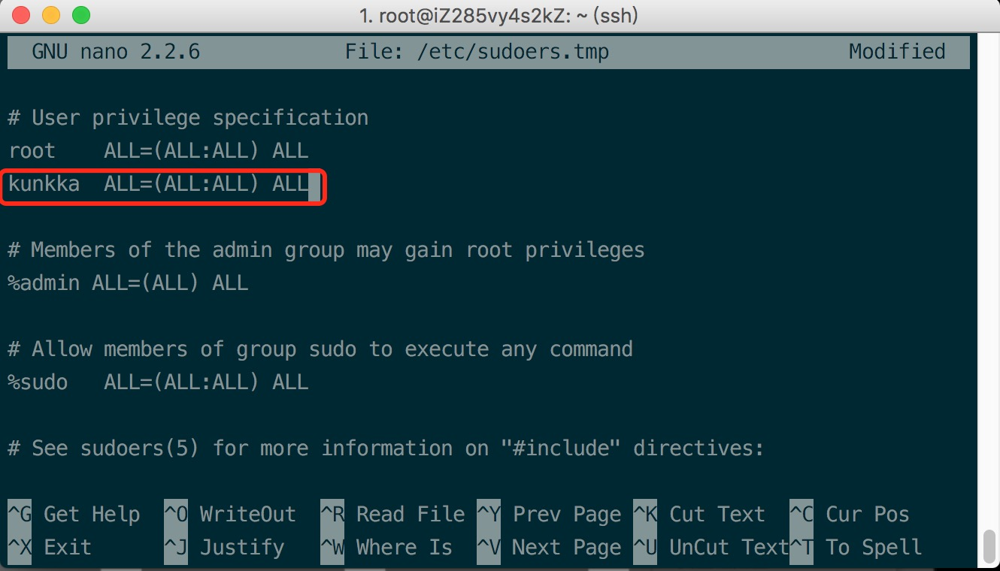
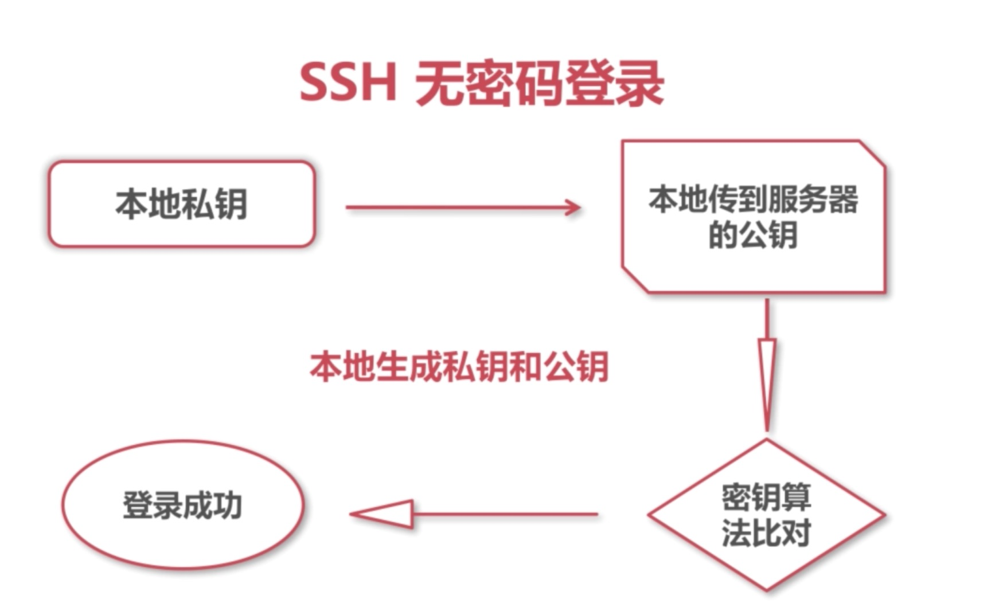

## 一、SSH 远程服务器登录

- SSH 远程登录

    1、SSH连接
    ```cmd
    ssh 用户名@ip地址
    ```
    2、查看数据盘
    ```cmd
    fdisk -l
    ```
    3、查看硬盘使用情况
    ```cmd
    df -h
    ```

- 配置 root 及应用账号权限

    1、添加用户
    ```cmd
    adduser 用户名
    ```
    2、用户权限升级
    ```cmd
    1.gpasswd -a 用户名 sudo
    2.sudo visudo
    ```
    

- 配置本地无密码 SSH 登录

    

    1、生成公钥和私钥 (本地服务器都需生成)
    ```cmd
    ssh-keygen -t rsa -b 4096 -C "邮箱"
    ```
    2、开启 ssh 代理 (本地服务器都需生成)
    ```cmd
    eval "$(ssh-agent -s)"
    ```
    3、ssh key 加入到代理中 (本地服务器都需生成)
    ```cmd
    ssh-add ~/.ssh/id_rsa
    ```
    4、服务器 .ssh 文件夹中创建 authorized_keys 文件
    > 内容为本地公钥

    ```cmd
    vi authorized_keys
    ```
    5、改变 authorized_keys 权限为600，并重启ssh
    ```cmd
    chomd 600 authorized_keys
    service ssh restart
    ```

## 二、增强服务器安全等级
- 修改服务器默认端口
    ```cmd
    vi /etc/ssh/sshd_config
    ```
    修改端口号，保证 `UseDNS` 为 `no`，最后添加 `AllowUsers 用户名`；关闭root密码登录`PermitRootLogin no`，`PasswordAuthentication no`，`PermitEmptyPasswords no`

- 配置 iptables 和 Fail2Ban

    **（一）、iptables**

    1、升级更新 Ubuntu
    ```cmd
    sudo apt-get update && sudo apt-get upgrade
    ```
    2、清空 iptables 规则
    ```cmd
    sudo iptables -F
    ```
    3、配置 iptables 规则
    ```cmd
    sudo vi /etc/iptables.up.rules
    ```
    ```
    *filter

    # allow all connections
    -A INPUT -m state --state ESTABLISHED,RELATED -j ACCEPT

    # allow out traffic
    -A OUTPUT -j ACCEPT

    # allow http https
    -A INPUT -p tcp --dport 443 -j ACCEPT
    -A INPUT -p tcp --dport 80 -j ACCEPT

    # allow ssh port login
    -A INPUT -p tcp -m state --state NEW --dport 39999 -j ACCEPT

    # ping
    -A INPUT -p icmp -m icmp --icmp-type 8 -j ACCEPT

    # log denied calls
    -A INPUT -m limit --limit 5/min -j LOG --log-prefix "iptables denied:" --log-level 7

    #drop incoming sensitive connections
    -A INPUT -p tcp --dport 80 -i eth0 -m state --state NEW -m recent --set
    -A INPUT -p tcp --dport 80 -i eth0 -m state --state NEW -m recent --update --seconds 60 --hitcount 150 -j DROP

    # reject all other inbound
    -A INPUT -j REJECT
    -A FORWARD -j REJECT

    COMMIT
    ```
    4、指定 iptables 文件位置
    ```cmd
    sudo iptables-restore < /etc/iptables.up.rules
    ```
    5、查看开启防火墙
    ```
    sudo ufw enable  // 开启防火墙
    sudo ufw status  // 查看防火墙状态（inactive、active）
    ```
    6、创建 shell 脚本 开机自动启动 iptables
    ```cmd
    sudo vi /etc/network/if-up.d/iptables
    ```
    ```
    #!/bin/sh
    iptables-restore /etc/iptables.up.rules
    ```
    设置执行权限
    ```cmd
    sudo chmod +x /etc/network/if-up.d/iptables
    ```

    **（二）、Fail2Ban**

    1、安装
    ```cmd
    sudo apt-get install fail2ban
    ```

    2、打开编辑 Fail2Ban 配置文件
    ```cmd
    sudo vi /etc/fail2ban/jail.conf
    ```

    ```
    bantime  = 3600 // 24行
    destemail = buxingmengzhong@163.com // 57行 改成自己邮箱地址
    action = %(action_mw)s // 102行
    ```

    3、Fail2Ban 基本操作
    ```cmd
    sudo service fail2ban status  // 查看 Fail2Ban 状态
    sudo service fail2ban stop    // 停止
    sudo service fail2ban start   // 开始
    ```

## 三、搭建 NodeJs 生产环境

- 搭建服务器的 NodeJs 环境

    1、更新Ubuntu
    ```cmd
    sudo apt-get update
    ```
    2、安装模块
    ```cmd
    sudo apt-get install vim openssl build-essential libssl-dev wget curl git
    ```
    3、安装 nvm 管理nodeJs版本
    ```cmd
    wget -qO- https://raw.githubusercontent.com/creationix/nvm/v0.33.2/install.sh | bash
    ```
    4、安装 nodeJs
    ```cmd
    nvm install v6.10.2        // 需要安装nodejs的版本号
    nvm use v6.10.2            // 指定版本
    nvm alias default v6.10.2  // 设置默认
    npm --registry=https://registry.npm.taobao.org install -g npm          // 用淘宝镜像更新npm
    ```
    5、增加系统文件监控数目
    ```cmd
    echo fs.inotify.max_user_watches=524288 | sudo tee -a /etc/sysctl.conf && sudo sysctl -p
    ```
    6、安装常用工具包
    ```cmd
    npm install pm2 webpack gulp grunt-cli -g
    ```

- 借助 pm2 让 Nodejs 服务常驻

    pm2 基本使用
    ```
    pm2 start 项目      // 开启服务
    pm2 list           // 查看当前运行的node服务
    pm2 show 项目名字   // 查看项目详细信息
    pm2 logs           // 日志
    ```

## 四、配置 Nginx 实现反向代理

- 配置 Nginx 反向代理 Nodejs 端口

    1、清除 apache
    ```
    sudo service apache2 stop
    update-rc.d -f apache2 remove
    sudo apt-get remove apache2
    ```

    2、更新 apt-get
    ```
    sudo apt-get update
    ```

    3、安装 Nginx
    ```
    sudo apt-get install nginx
    ```

    4、进入/etc/nginx/conf 目录 添加文件
    ```
    sudo vi java0229-com-8081.conf  // 文件名自定义

    内容
    upstream imooc {
        server 127.0.0.1:8081;
    }

    server {
          listen 80;
          server_name 121.42.49.231;

          location / {
            proxy_set_header X-Real-IP $remote_addr;
            proxy_set_header X-Forward-For $proxy_add_x_forwarded_for;
            proxy_set_header Host $http_host;
            proxy_set_header X-Nginx-Proxy true;

            proxy_pass http://imooc;
            proxy_redirect off;
          }
    }
    ```

    5、检查配置文件是否有问题
    ```
    sudo nginx -t
    ```

    6、重启 Nginx
    ```
    sudo nginx -s reload
    ```

    7、编辑 nginx.conf 文件取消请求头header里Nginx的信息
    ```
    server_tokens off;  // 取消注释
    sudo service nginx reload // 重载nginx
    ```

## 五、服务器配置安装 MongoDB

- 在 Ubuntu 14.04 上安装 MongoDB

    1、根据 MongoDB [官网文档](https://docs.mongodb.com/master/tutorial/install-mongodb-on-ubuntu/) 安装 MongoDB 数据库

    2、MongoDB 基本使用
    ```
    // 开启 mongodb
    sudo service mongod start

    // 关闭 mongodb
    sudo service mongod stop

    // 重启 mongodb
    sudo service mongod restart

    // 编辑 mongodb 默认端口
    sudo vi /etc/mongod.conf

    // 指定端口登录
    mongo --port 19999

    // 配置 /etc/iptables.up.rules mongodb权限
    # mongodb connect
    -A INPUT -s 127.0.0.1 -p tcp --destination-port 19999 -m state --state NEW,ESTABLISHED -j ACCEPT
    -A OUTPUT -d 127.0.0.1 -p tcp --source-port 27017 -m state --state NEW,ESTABLISHED -j ACCEPT
    ```

- 往线上 MongoDB 导入单表数据或数据库

    1、导出数据库
    ```
    // 本地导出
    mongodump -h 127.0.0.1:27017 -d indust-app -indust-app-backup

    // mongodump -h 127.0.0.1:19999 -d 数据库名 -u 数据库用户名 -p 密码 -o 导出后的文件名
    mongodump -h 127.0.0.1:19999 -d indust-app -u indust_app_wheel -p 111111 -o indust-app-old
    ```

    2、压缩上传
    ```
    // tar zcvf 压缩后文件名 原文件名
    tar zcvf indust-app.tar.gz data

    // 上传
    cp -P 39999 ./indust-app.tar.gz kunkka@121.42.49.231:/home/kunkka/dbbackup/
    ```

    3、解压缩
    ```
    tar xvf indust-app.tar.gz
    ```

    4、导入 mongodb 数据
    ```
    // mongorestore --host 127.0.0.1:19999 -d 数据库名 导入的数据
    mongorestore --host 127.0.0.1:19999 -d indust-app ./dbbackup/data/indust-app/
    ```

- 为上线项目配置 MongoDB 数据库读写权限

    1、添加用户
    ```
    mongo --port 19999

    use admin

    // 添加管理员
    db.createUser({user: 'kunkka', pwd: '111111', roles: [{role: 'userAdminAnyDatabase', db: 'admin'}]})

    // 对用户登录进行授权 （返回 1 授权成功）
    db.auth('kunkka', '111111')

    // imooc-movie
    use imooc-movie
    // 创建读写用户
db.createUser({user: 'imooc_movie_runner', pwd: '111111', roles: [{role: 'readWrite', db: 'imooc-movie'}]})
    // 添加备份用户
    db.createUser({user: 'imooc_movie_wheel', pwd: '111111', roles: [{role: 'read', db: 'imooc-movie'}]})

    // imooc-app
    use imooc-app
    db.createUser({user: 'imooc_app_runner', pwd: '111111', roles: [{role: 'readWrite', db: 'imooc-app'}]})
    db.createUser({user: 'imooc_app_wheel', pwd: '111111', roles: [{role: 'read', db: 'imooc-app'}]})

    // indust-app
    use indust-app
    db.createUser({user: 'indust_app_runner', pwd: '111111', roles: [{role: 'readWrite', db: 'indust-app'}]})
    db.createUser({user: 'indust_app_wheel', pwd: '111111', roles: [{role: 'read', db: 'indust-app'}]})

    // imooc-wechat
    use imooc-wechat
    db.createUser({user: 'imooc_wechat_runner', pwd: '111111', roles: [{role: 'readWrite', db: 'imooc-wechat'}]})
    db.createUser({user: 'imooc_wechat_wheel', pwd: '111111', roles: [{role: 'read', db: 'imooc-wechat'}]})
    ```

    2、开启用户验证模式
    ```
    // 打开 mongod.conf
    sudo vi /etc/mongod.conf

    // 29行修改 （authorization 前面有两个空格）
    security:
        authorization: 'enabled'
    ```
    3、重启 mongodb 使配置生效
    ```
    sudo service mongod restart
    ```

    4、直接登录到指定的数据库
    ```
    //  mongo 127.0.0.1:19999/indust-app -u 用户名 -p 密码
     mongo 127.0.0.1:19999/indust-app -u indust_app_runner -p 111111
    ```

- 为数据库实现定时备份方案

    1、创建定时脚本
    ```
    sudo vi indust.backup.sh

    // 内容
    #!/bin/sh

    backUpFolder=/home/kunkka/backup/indust
    date_now=`date +%Y_%m_%d_%H%M`
    backFileName=indust_$date_now

    cd $backUpFolder
    mkdir -p $backFileName

    mongodump -h 127.0.0.1:19999 -d indust-app -u indust_app_wheel -p 111111 -o $backFileName

    tar zcvf $backFileName.tar.gz $backFileName

    rm -rf $backFileName

    // 上传七牛
    NODE_ENV=$backUpFolder@$backFileName node /home/kunkka/tasks/upload.js
    ```

    2、执行脚本
    ```
    sudo sh ./tasks/indust.backup.sh
    ```

    3、启动系统自动任务的设定
    ```
    crontab -e

    // 添加
    // 分钟 小时 * * * sh /home/kunkka/tasks/indust.backup.sh
    42 16 * * * sh /home/kunkka/tasks/indust.backup.sh
    ```

- 上传数据库备份到七牛私有云

    1、创建上传脚本 内容 参考 [七牛SDK文档](https://developer.qiniu.com/kodo/sdk/1289/nodejs)
    ```
    vi upload.js

    // 内容
    var qiniu = require("qiniu");

    var parts = process.env.NODE_ENV.split('@');
    var file = parts[1] + '.tar.gz';
    var filePath = parts[0] + '/' + file;

    //需要填写你的 Access Key 和 Secret Key
    qiniu.conf.ACCESS_KEY = 'Access_Key';
    qiniu.conf.SECRET_KEY = 'Secret_Key';

    //要上传的空间
    bucket = 'industdeploydb';

    //上传到七牛后保存的文件名
    key = file;

    //构建上传策略函数
    function uptoken(bucket, key) {
      var putPolicy = new qiniu.rs.PutPolicy(bucket+":"+key);
      return putPolicy.token();
    }

    //生成上传 Token
    token = uptoken(bucket, key);

    //要上传文件的本地路径
    //filePath = './ruby-logo.png'

    //构造上传函数
    function uploadFile(uptoken, key, localFile) {
      var extra = new qiniu.io.PutExtra();
        qiniu.io.putFile(uptoken, key, localFile, extra, function(err, ret) {
          if(!err) {
            // 上传成功， 处理返回值
            console.log(ret.hash, ret.key, ret.persistentId);
          } else {
            // 上传失败， 处理返回代码
            console.log(err);
          }
      });
    }

    //调用uploadFile上传
    uploadFile(token, key, filePath);

    ```

## 六、向服务器正式部署和发布上线 Nodejs 项目

- 上传项目代码到线上私有 Git 仓库

    1、本地上传代码到私有云仓库
    ```
    // 添加本地全局上传的用户名和邮箱
    git config --global user.name 'kunkka'
    git config --global user.email 'buxingmengzhong@163.com'

    // 初始化仓库
    git init

    // 添加所有文件
    git add .

    // 提交
    git commit -m 'First commit'

    // 关联推送私有云地址
    git remote add origin git@git.oschina.net:kunkka0229/backend-website.git

    // 推送到仓库
    git push -u origin master

    // 更新下载远端仓库代码
    git fetch

    // 合并
    git merge origin/master // 报错就用下边的命令
    git pull origin master --allow-unrelated-histories

    ```

- 配置 PM2 一键部署线上项目结构

    1、本地根据文档创建 [ecosystem](http://pm2.keymetrics.io/docs/usage/deployment/) 文件
    ```json
    {
      "apps": [
        {
          "name": "Website",
          "script": "app.js",
          "env": {
            "COMMON_VARIABLE": "true"
          },
          "env_production": {
            "NODE_ENV": "production"
          }
        }
      ],
      "deploy": {
        "production": {
          "user": "kunkka",
          "host": ["121.42.49.231"],
          "ref": "origin/master",
          "repo": "git@git.oschina.net:kunkka0229/backend-website.git",
          "path": "/www/website/production",
          "ssh_options": "StrictHostKeyChecking=no",
          "env": {
            "NODE_ENV": "production"
          }
        }
      }
    }
    ```

    2、服务器创建 /www/website
    ```
    sudo mkdir /www
    sudo mkdir website
    ```

    3、本地pm2连接服务器，创建发布项目的文件夹
    ```
    // pm2 deploy ecosystem.json 任务名 setup
    pm2 deploy ecosystem.json production setup
    ```

    4、修改服务器website文件夹权限
    ```
    sudo chmod 777 website/
    ```

- 从本地发布上线和更新服务器的 Nodejs 项目

    1、发布
    ```
    pm2 deploy ecosystem.json production
    ```

    2、修改 /etc/nginx/conf.d 中的配置文件
    ```
    upstream website {
        server 127.0.0.1:3000;
    }

    server {
          listen 80;
          server_name www.java0229.com;

          location / {
            proxy_set_header X-Real-IP $remote_addr;
            proxy_set_header X-Forward-For $proxy_add_x_forwarded_for;
            proxy_set_header Host $http_host;
            proxy_set_header X-Nginx-Proxy true;

            proxy_pass http://website;
            proxy_redirect off;
          }
    }
    ```

    3、修改iptables防火墙增加3000端口的访问
    ```
    # website
    -A INPUT -s 127.0.0.1 -p tcp --destination-port 3000 -m state --state NEW,ESTABLISHED -j ACCEPT
    -A OUTPUT -d 127.0.0.1 -p tcp --source-port 3000 -m state --state NEW,ESTABLISHED -j ACCEPT
    ```

- 部署发布电影网站并连接线上 MongoDB

    1、/www 目录下增加movie文件夹并添加 777 权限
    ```
    sudo mkdir movie
    sudo chmod 777 -R movie
    ```

    2、/etc/nginx/conf.d 中添加配置文件
    ```
    // 复制 website 的配置文件
    sudo cp www-java0229-com-3000.conf movie-java0229-com-3001.conf

    // 内容修改为
    upstream movie {
        server 127.0.0.1:3001;
    }

        server {
          listen 80;
          server_name movie.java0229.com;

          location / {
            proxy_set_header X-Real-IP $remote_addr;
            proxy_set_header X-Forward-For $proxy_add_x_forwarded_for;
            proxy_set_header Host $http_host;
            proxy_set_header X-Nginx-Proxy true;

            proxy_pass http://movie;
            proxy_redirect off;
          }

          location ~* ^.+\.(jpg|jpeg|gif|png|ico|css|js|pdf|txt){
            root /www/movie/production/current/public;
          }
    }
    ```

    3、本地pm2连接服务器，创建发布项目的文件夹
    ```
    // pm2 deploy ecosystem.json 任务名 setup
    pm2 deploy ecosystem.json production setup
    ```

    4、修改iptables防火墙增加3000端口的访问
    ```
    # movie
    -A INPUT -s 127.0.0.1 -p tcp --destination-port 3001 -m state --state NEW,ESTABLISHED -j ACCEPT
    -A OUTPUT -d 127.0.0.1 -p tcp --source-port 3001 -m state --state NEW,ESTABLISHED -j ACCEPT
    ```

- 部署 ReactNative App 线上 API 服务

    1、/www 目录下增加movie文件夹并添加 777 权限
    ```
    sudo mkdir app
    sudo chmod -R 777 app
    ```

    2、/etc/nginx/conf.d 中添加配置文件
    ```
     // 复制 website 的配置文件
    sudo cp www-java0229-com-3000.conf app-java0229-com-3002.conf

    // 内容
    upstream app {
        server 127.0.0.1:3002;
    }

    server {
          listen 80;
          server_name app.java0229.com;

          location / {
            proxy_set_header X-Real-IP $remote_addr;
            proxy_set_header X-Forward-For $proxy_add_x_forwarded_for;
            proxy_set_header Host $http_host;
            proxy_set_header X-Nginx-Proxy true;

            proxy_pass http://app;
            proxy_redirect off;
          }
    }
    ```

    3、修改iptables防火墙增加3000端口的访问
    ```
    # app
    -A INPUT -s 127.0.0.1 -p tcp --destination-port 3002 -m state --state NEW,ESTABLISHED -j ACCEPT
    -A OUTPUT -d 127.0.0.1 -p tcp --source-port 3002 -m state --state NEW,ESTABLISHED -j ACCEPT
    ```

    4、重新加载 iptable 并重启 ngin
    ```
    sudo iptables-restore < /etc/iptables.up.rules
    sudo nginx -s reload
    ```

    5、本地 pm2 部署项目
    ```
    pm2 deploy ecosystem.json production setup
    ```

- 部署微信小程序线上 API 服务

    1、/www 目录下增加movie文件夹并添加 777 权限
    ```
    sudo mkdir indust
    sudo chmod -R 777 indust
    ```

    2、/etc/nginx/conf.d 中添加配置文件
    ```
     // 复制 website 的配置文件
    sudo cp www-java0229-com-3000.conf indust-java0229-com-3003.conf

    // 内容
    upstream indust {
        server 127.0.0.1:3003;
    }

    server {
          listen 80;
          server_name indust.java0229.com;

          location / {
            proxy_set_header X-Real-IP $remote_addr;
            proxy_set_header X-Forward-For $proxy_add_x_forwarded_for;
            proxy_set_header Host $http_host;
            proxy_set_header X-Nginx-Proxy true;

            proxy_pass http://indust;
            proxy_redirect off;
          }
    }
    ```

    3、修改iptables防火墙增加3000端口的访问
    ```
    # indust
    -A INPUT -s 127.0.0.1 -p tcp --destination-port 3003 -m state --state NEW,ESTABLISHED -j ACCEPT
    -A OUTPUT -d 127.0.0.1 -p tcp --source-port 3003 -m state --state NEW,ESTABLISHED -j ACCEPT
    ```

    4、重新加载 iptable 并重启 nginx
    ```
    sudo iptables-restore < /etc/iptables.up.rules
    sudo nginx -s reload
    ```

    5、本地 pm2 部署项目
    ```
    pm2 deploy ecosystem.json production setup

    pm2 deploy ecosystem.json production
    ```

## 七、使用和配置更安全的 HTTPS 协议

- 云平台申请免费证书及 Nginx 配置

    1、腾讯云申请 ssl 证书并下载上传到服务器
    ```
    scp -P 39999 ./1_free.java0229.com_bundle.crt kunkka@121.42.49.231:/home/kunkka
1_free.java0229.com_bundle.crt

    cp -P 39999 ./2_free.java0229.com.key kunkka@121.42.49.231:/home/kunkka
2_free.java0229.com.key
    ```

    2、服务器 nginx 配置 /etcx/nginx/nginx.d/free-java0229-com-3002.conf
    ```
    upstream free {
      server 127.0.0.1:3002;
    }

    server {
      listen 80;
      server_name free.java0229.com;
      #rewrite ^(.*) https://$host$1 permanent;
      return 301 https://free.java0229.com$request_uri;
    }

    server {
      listen 443;
      server_name free.java0229.com; #填写绑定证书的域名
      ssl on;
      ssl_certificate /www/ssl/1_free.java0229.com_bundle.crt;
      ssl_certificate_key /www/ssl/2_free.java0229.com.key;
      ssl_session_timeout 5m;
      ssl_protocols TLSv1 TLSv1.1 TLSv1.2; #按照这个协议配置
      ssl_ciphers ECDHE-RSA-AES128-GCM-SHA256:HIGH:!aNULL:!MD5:!RC4:!DHE;#按照这个套件配置
      ssl_prefer_server_ciphers on;

      if ($ssl_protocol = "") {
        rewrite ^(.*) https://$host$1 permanent;
      }

      location / {
        proxy_set_header X-Real-IP $remote_addr;
        proxy_set_header X-Forward-For $proxy_add_x_forwarded_for;
        proxy_set_header Host $http_host;
        proxy_set_header X-Nginx-Proxy true;

        proxy_pass http://free;
        proxy_redirect off;
      }
    }
    ```

    3、检查从起 nginx
    ```
    sudo nginx -t // 检查

    sudo ngind -s reload // 重启
    ```
